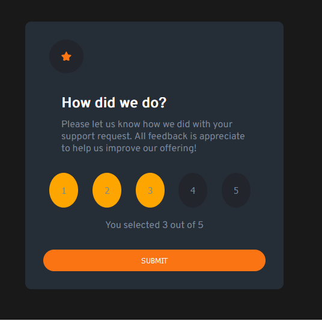

# Interactive Rating Component
[Live Demo](https://jn-interactive-rating-component.netlify.app/)

## About the project
This project was inspired by a Front End Mentor challenge but I adapted the project and added my own features. When you select a rating, it will highlight the other buttons up to the one you selected and also provides an output text of your selected rating. When you click the submit button, the buttons cannot be selected until you click reset.

## Technologies Used

This application is built using the following technologies:

- HTML
- CSS
- JavaScript

